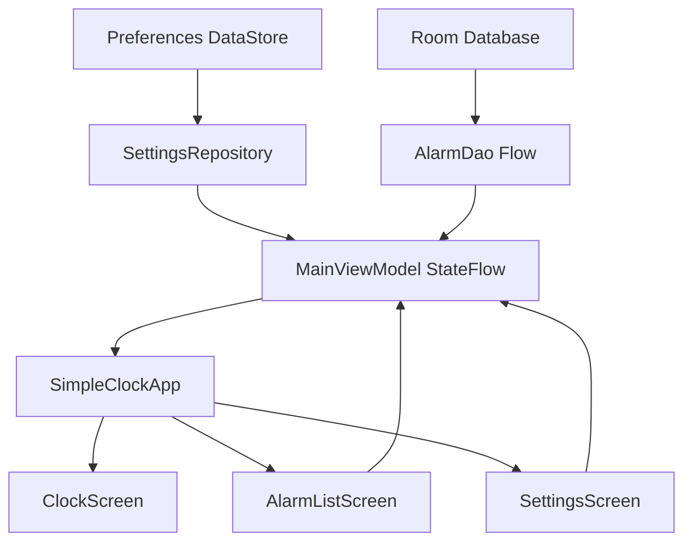

# 系統架構與技術文件

## 架構摘要

本專案是單一 Android Application 模組，採用 Kotlin 與 Jetpack Compose。整體可描述為「以 `AndroidViewModel` 為中心的單 Activity 狀態架構」：Compose UI 從 `StateFlow` 取得狀態，使用者操作交由 `MainViewModel` 協調，資料分別保存於 Room、Preferences DataStore 與 Widget 專用 SharedPreferences。

專案沒有採用 Hilt、Dagger、Koin 或 Navigation Compose。`SimpleClockApplication` 作為手動依賴容器，App 內導覽則由 `AppDestination` 狀態與 `when` 切換畫面。

## 模組

```text
android-clock-01/
├── app/                    Android Application 模組
│   ├── src/main/           正式程式與資源
│   └── src/test/           JVM 單元測試
├── docs/                   專案文件
├── build.gradle.kts        根專案建置設定
├── settings.gradle.kts     Gradle 模組設定
└── gradle/                 Version Catalog 與 Wrapper
```

目前只有 `:app`，沒有 library、feature module 或 product flavor。

## Package 結構

### `com.simpleclock.app`

- `SimpleClockApplication`：建立 Room、設定 Repository 與鬧鐘 Scheduler。
- `MainActivity`：Compose Host、系統權限流程、Widget 啟動處理。
- `MainViewModel`：App 狀態、設定保存、鬧鐘 CRUD 及排程協調。

### `com.simpleclock.app.data`

- `AppSettings`：設定資料模型、時鐘樣式與背景列舉。
- `SettingsRepository`：Preferences DataStore 讀寫。
- `AppDatabase`：Room Database 與 migration 設定。
- `AlarmEntity`：鬧鐘定義。
- `AlarmOccurrenceEntity`：每一次實際排程的持久化紀錄。
- `AlarmDao`：鬧鐘與 Occurrence 查詢、更新及交易。
- `Hue`：色相正規化、HSV 轉 ARGB 及色票工具。

### `com.simpleclock.app.alarm`

- `AlarmCapabilities`：通知、精準鬧鐘及全螢幕通知能力判斷。
- `AlarmTimeCalculator`：下一次響鈴時間計算。
- `AlarmScheduler`：同步 Room Occurrence、AlarmManager 與通知。
- `AlarmReceiver`：到點驗證 Occurrence 並啟動響鈴服務。
- `UpcomingAlarmReceiver`：提前提醒及延後提醒通知。
- `RescheduleReceiver`：處理開機、App 更新、時間、時區與權限狀態變更。
- `AlarmRingingService`：前景響鈴、音訊、振動、停止與延後。
- `AlarmActivity`：鎖定畫面上的全螢幕響鈴介面。

### `com.simpleclock.app.ui`

- `SimpleClockApp`：主題、系統列、方向與目的地協調。
- `ClockScreen`：主時鐘及底部控制列。
- `ClockDisplays`：數字、Canvas 及指針時鐘繪製。
- `AlarmListScreen`：鬧鐘清單、編輯與排序。
- `SettingsScreen`：顯示、色彩、背景及樣式設定。
- `ThemeMotionBackground`：九種背景紋路與動畫。
- `HueSlider`：共用 Hue 選擇元件。
- `SimpleClockTheme`、`SystemThemePalette`：Material 3 主題與自訂色票。

### `com.simpleclock.app.widget`

- `ClockWidgetProvider`：建立及更新 RemoteViews。
- `WidgetConfigActivity`：新增 Widget 時的 Compose 設定畫面。
- `WidgetPreferences`：每個 Widget ID 的獨立設定。

## UI 狀態資料流



設定更新採 optimistic 模式：

```text
使用者操作
  → MainViewModel.updateSettings(transform)
  → 立即更新記憶體 StateFlow
  → Compose 重新組合
  → viewModelScope 非同步寫入 SettingsRepository
```

## 導覽

App 內只有三個目的地：

- `CLOCK`
- `ALARMS`
- `SETTINGS`

`SimpleClockApp` 依 `MainViewModel.destination` 使用 `when` 顯示對應畫面。專案不維護一般 Navigation back stack；從設定或鬧鐘頁返回時直接回到主時鐘。

## 依賴方向

```text
Compose UI
  → MainViewModel
  → AlarmDao / SettingsRepository / AlarmScheduler
  → Room / DataStore / AlarmManager

Receiver / Service / AlarmActivity
  → SimpleClockApplication
  → AlarmDao / AlarmScheduler
```

目前 ViewModel 會直接存取 DAO，並未另外建立 Domain 或 Use Case 層。此設計適合目前單模組規模；若未來加入世界時鐘、計時器或雲端同步，可再將排程與資料操作抽成獨立 domain 層。

## 技術選型

| 技術 | 用途 |
| --- | --- |
| Kotlin | 主要程式語言 |
| Jetpack Compose | App 與 Widget 設定 UI |
| Material 3 | 元件與主題 |
| Room | 鬧鐘及排程 Occurrence |
| Preferences DataStore | App 顯示與外觀設定 |
| SharedPreferences | 每個 Widget ID 的設定 |
| AlarmManager | 精準鬧鐘與提前通知排程 |
| Foreground Service | 響鈴、音訊與振動生命週期 |
| RemoteViews / TextClock | 桌面小工具 |
| Kotlin Coroutines / Flow | 非同步工作與狀態串流 |

## 執行緒與生命週期

- `MainViewModel` 使用 `viewModelScope` 保存設定及執行資料操作。
- Receiver 透過 `goAsync()` 執行資料庫驗證，完成後結束 PendingResult。
- `AlarmScheduler` 使用 Coroutine `Mutex` 序列化排程修改。
- `AlarmRingingService` 是前景服務，可在 UI 不可見時維持響鈴。
- 背景動畫由 Compose `rememberInfiniteTransition` 管理，只有主時鐘進入 Composition 時運作。

## 架構限制

- 設定保存失敗目前不會回報 UI。
- App 內導覽沒有 SavedState 或 back stack。
- Application 是手動 Service Locator，測試替換相依物較困難。
- Receiver、Service、權限及 Widget 尚缺完整 instrumentation 測試。
- Room 除 `3 → 4` 外允許 destructive migration，正式版前應重新評估資料相容政策。
