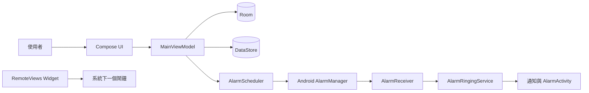
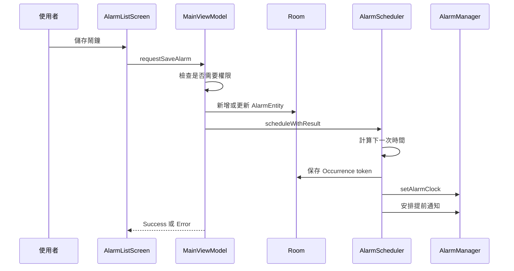

# 系統設計文件

## 設計目標

本系統最重要的設計目標是：

- 在不同 Android 版本上準時觸發本機鬧鐘。
- 避免已刪除、停用或被重新排程的舊 Intent 誤響。
- 在裝置重開機、App 更新、時間或時區變更後恢復正確排程。
- 讓 App 設定立即反映於 UI，並在本機持久化。
- 讓桌面小工具不依賴 App 常駐或固定週期更新。

## 系統邊界

系統沒有遠端後端。Android Framework 的 AlarmManager、NotificationManager、前景服務與 AppWidget 是主要外部邊界。

## 鬧鐘資料模型

系統把「鬧鐘定義」與「實際排程」分開：

- `AlarmEntity` 表示使用者設定，例如時間、星期、名稱與啟用狀態。
- `AlarmOccurrenceEntity` 表示一個已交付給 AlarmManager 的實際觸發事件。

每個 Occurrence 有 UUID token。相同 token 同時存在於 Room 與 PendingIntent URI／Extras，可用來驗證到達的 Intent 是否仍有效。

## 新增與更新流程

更新既有鬧鐘時會先取消舊 Occurrence 與 PendingIntent，再建立新排程。若建立新排程失敗：

- 新鬧鐘會刪除。
- 既有鬧鐘會嘗試恢復原始資料與原排程。

## 下一次響鈴計算

### 單次鬧鐘

- 今天目標時間尚未到達時使用今天。
- 已到達或超過該分鐘時使用明天。

### 重複鬧鐘

- 從今天到七天後依序尋找第一個已選星期且晚於現在的時間。
- 星期使用 bit mask，bit 0 到 bit 6 對應星期一到星期日。

### 夏令時間

- 若本地時間落在 DST gap，交由 `atZone()` 解析至有效時間。
- 若本地時間落在 overlap，從有效 offset 中選擇第一個仍晚於現在的 occurrence。

## AlarmManager 排程

主要響鈴使用 `AlarmManager.setAlarmClock()`，原因如下：

- 具備系統鬧鐘語意。
- 可向系統提供下一個鬧鐘資訊。
- 可附帶 `showIntent`，讓使用者從系統介面回到 App 鬧鐘頁。

響鈴前 10 分鐘的提醒使用 exact and allow while idle 排程。若排程時已進入提前通知時間窗，則直接發送提醒 Broadcast。

## 到點驗證

`AlarmReceiver` 收到 Intent 後不會立即響鈴，而是依序驗證：

1. Action、token、alarm ID、kind 與 trigger time 完整。
2. Room 中存在同 token 的 Occurrence。
3. 對應 AlarmEntity 仍存在且已啟用。
4. Occurrence 欄位與 Intent 完全相符。
5. Occurrence 尚未被其他 Receiver claim。
6. 目前時間已到且沒有晚超過允許範圍。
7. Regular occurrence 依目前設定重新計算後仍是同一時間。
8. 條件式更新 `claimedAt` 成功影響一列。

不符合條件的事件會被清理，不啟動響鈴服務。

## 響鈴服務

`AlarmRingingService` 是 media playback 前景服務：

- 顯示高重要性 ongoing 通知。
- 使用系統預設鬧鐘鈴聲。
- 優先以循環 MediaPlayer 播放，失敗時改用 Ringtone。
- 請求 alarm 用途的音訊焦點。
- 直接控制循環振動。
- 最長響鈴 15 分鐘。
- 支援停止及延後 10 分鐘。

若另一個 Occurrence 在響鈴期間到達，服務會放入記憶體 FIFO 佇列，完成目前項目後再處理下一個。相同 token 重複到達會忽略。

## 停止與延後

### 停止

- 完成並刪除目前 Occurrence。
- 單次鬧鐘設為停用。
- 重複鬧鐘保留啟用狀態，下一次已由排程流程安排。

### 延後

- 建立新的 `SNOOZE` Occurrence。
- Trigger time 設為目前時間後 10 分鐘。
- 立即顯示無聲延後通知。
- 若延後建立失敗，系統會完成目前項目並依單次／重複規則處理。

## 排程恢復

`RescheduleReceiver` 接收以下事件：

- 裝置開機完成。
- App 套件更新。
- 系統時間變更。
- 時區變更。
- 精準鬧鐘能力狀態變更。

恢復策略分為：

- **Restart restore**：開機或 App 更新後恢復仍有效排程。
- **Regular recalculation**：時間或時區變更後重算一般鬧鐘，延後鬧鐘保留原 epoch。
- **Epoch restore**：精準鬧鐘能力恢復後按原 trigger epoch 重新註冊。

## 通知設計

### 響鈴頻道

- 高重要性、公開鎖定畫面內容。
- Category 為 Alarm。
- 通知本身不播放聲音或振動，統一由前景服務控制。
- 提供停止及延後操作。
- 平台允許時附帶全螢幕 Intent。

### 提前與延後頻道

- 低重要性、無聲、無振動。
- 顯示預定響鈴時間。
- 提供取消本次提醒操作。

## 設定系統

`AppSettings` 是不可變資料類別。UI 以 copy transform 更新，ViewModel 先修改 StateFlow，再保存整份設定。系統色彩預覽另外維護暫存 Hue，拖曳時即時套用，完成後才寫入 DataStore，減少連續磁碟寫入。

## 時鐘繪製系統

`ClockStyleDisplay` 是統一入口：

- 文字樣式交由 Compose Text。
- LED、玻璃、輝光管及指針樣式使用自訂繪製。
- `ClockStyle.category` 統一數字、圓形與方形分類。
- 指針鐘即使隱藏秒針仍每秒更新，使分針與時針包含秒級進度。
- 方形指針鐘使用長方形射線交點放置刻度，畫布維持固定直立比例。

## Widget 設計

Widget 採 RemoteViews 與 `TextClock`，不使用 Glance：

- `TextClock` 由系統更新時間，不需要固定 Provider refresh interval。
- Provider 在組態、語系、時區及下一個鬧鐘變更時更新內容。
- 下一個鬧鐘取自 `AlarmManager.nextAlarmClock`，可同時反映本 App 與其他系統鬧鐘來源。
- 點擊 App 時帶入 Widget 啟動旗標並關閉 Activity 轉場動畫。

## 失敗模式與處理

| 失敗 | 目前處理 |
| --- | --- |
| 權限不足 | 保留使用者設定，透過 Activity 引導系統設定 |
| 排程失敗 | UI 顯示錯誤，新資料刪除或舊資料回滾 |
| 舊 PendingIntent 到達 | 以 Occurrence token 與時間重新驗證後拒絕 |
| MediaPlayer 失敗 | 改用 Ringtone |
| 裝置重新啟動 | Receiver 重新註冊有效 Occurrence |
| 時區／時間變更 | 重算 Regular，保留 Snooze epoch |
| 多個鬧鐘同時到達 | 前景服務 FIFO 排隊 |

## 後續設計方向

- 將設定保存結果回報 UI。
- 將權限狀態與使用者啟用意圖更完整地分離。
- 增加 Room migration、Receiver、Service、通知及 Widget instrumentation 測試。
- 正式版前建立非 Debug Key 的安全簽署及金鑰管理流程。
- 若功能持續增加，將排程與資料邏輯抽為獨立 domain/use-case 層。
